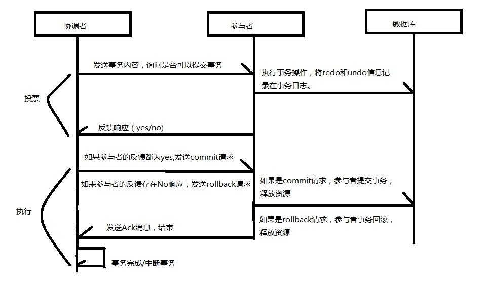

一：什么是事务。

事务是由一系列对系统中的数据进行访问和更新的操作所组成的一个程序执行逻辑单元。狭义上的事务指的就是数据库的事务。

二：事务（ACID）的特性。

事务具有四个特性：
1.一致性(Consistency):事务的操作需要从一个一致性状态到另一个一致性状态。如果一次事务中，有些操作更新成功，有些操作更新失败，这就是不一致的。

2.原子性(Automicity)：指事务是一个原子操作序列单元。一个事务下的操作要么全部执行成功，要么全部执行不成功。

3.持久性(Durability):指事务一旦提交，对数据库中的数据的变更操作就是永久的。

4.隔离性(Isolation):指不同的事务操作互不影响。

事务的隔离级别：

|-----|------|
|隔离级别|特点|
|读未提交(read uncommitted)|另一事务可以看见一个事务提交前的所有状态。|
|读已提交(read committed)|只允许读取到事务提交之后的状态。|
|可重复读(repeatable read)|只允许读取到事务开始时刻的状态。|
|序列化(serializable)|事务串行执行。|

关于读已提交和可重复读的区别：
(1)读已提交（又叫不可重复读）隔离级别下，如果事务A的一个操作读取了一条记录，然后事务B修改了这条记录，接着事务A的另一个操作再读取这条记录的时候就发现被修改了。所以对于读已提交来说，需要注意的是另一个事务的更新或是删除操作。

(2)可重复读隔离级别下，如果事务A的一个操作读取了一张表的记录，事务B不能对这张表的数据进行删除或是更新，这样就保障了可重复读，但是事务B是可以对这张表进行插入操作的，事务B向这张表插入一条记录后，事务A的另一个操作再读取这张表的数据，就发现多了一条记录，这就是幻读的产生。所以对于可重复读来说，需要注意的是另一个事务的新增操作。

三:什么是分布式系统。

首先了解下从集中式到分布式的发展历程

20世纪60年代，人类发明了大型主机。大型主机具有超强的计算能力和I/O处理能力，在稳定性和安全性上也有良好的表现，因此集中式的计算机架构也就流行了起来。集中式系统是将一台或是几台计算机作为中心节点，所有的操作运算和数据的存储都是中心节点完成。一方面是大型主机价格昂贵，技术要求比较高，对主机进行扩容困难，一台主机不可用将造成整个系统不可用，另一方面是小型机和PC的发展，集中式架构逐步退出历史舞台，分布式架构走进人们的视野。

分布式系统指的是将一个硬件或是软件组件分布在不同的网络计算机上，彼此之间通过消息传递进行通信和协调的系统。

四：分布式系统的经典理论。

1.CAP理论
CAP指的是Consistency(一致性)、Availability(可用性)和Partition tolerance(分区容错性)。

(1)一致性:指数据在多个副本之间能够保持一致的特性。
有以下三种一致性级别：
a.强一致性：要求对系统数据的修改可以立刻读取，用户体验性最好。
b.弱一致性：不保证什么时候能达到一致性，但是尽可能保证在某个时间级别后，数据达到一致性。
c.最终一致性：弱一致性的一个特例，系统会保证在一定时间内，能够达到一个数据一致的状态。

(2)可用性：指系统提供的服务需要一直处于可用状态，对于用户的每一个操作请求总是能够在有限的时间内返回结果。

(3)分区容错性：分布式系统在遇到任何网络分区故障时，都需要能够保证一致性和可用性，除非整个网络都发生了故障。

2.BASE理论

BASE理论指的是Basically Avaliable(基本可用)、Soft state(软状态)和Eventually consistent(最终一致性)。

解释一下软状态，指的是允许系统中的数据存在中间状态，并认为该中间状态的存在不会影响系统的整体可用性。也就是允许不同数据副本的数据同步允许延迟。

五:什么是分布式事务

现在小明想要从银行A转500块钱到银行B，因为两家不同的银行，各自有自己的系统，自己的数据库，银行A先在小明的账户上扣除500块钱，然后银行B准备在小明的账户上加上500块钱，然而网络故障了，银行B的操作没有成功，这时候该怎么办呢？银行B怎么告诉银行A自己操作没成功，让银行A进行操作回滚呢？

分布式事务是指事务的参与者、支持事务的服务器，资源管理器以及事务管理器分别位于分布式系统的不同节点上。一个分布式事务会涉及多个数据源或是业务系统的操作。

六：分布式事务的一致性协议

如果一个操作涉及多个分布式节点，为了保证事务的ACID特性，需要引入一个“协调者”组件来统一调度所有分布式节点的执行逻辑，这些被调度的分布式节点被称为“参与者”。协调者负责调度参与者的行为，并最终决定这些参与者是否真正地提交事务。

1.二阶段提交协议(2PC：Two-Phase Commit)

缺点：
(1)各个参与者需要等待其他参与者的响应。
(2)如果协调者出现故障，其他参与者会一直锁定资源，无法完成事务操作。
(3)可能会因为网络原因导致只有部分参与者收到commit请求，部分参与者没有收到commit请求而出现数据不一致现象。
(4)协调者可能因为网络故障无法收到全部参与者的响应信息，只能依靠自身的超时机制决定是否中断事务。

2.三阶段提交协议(3PC：Three-Phase Commit)

过程：
.jpg)

.jpg)

参考资料：
《从Paxos到ZooKeeper分布式一致性原理与实践》
[不可重复读和幻读的区别](https://www.cnblogs.com/itcomputer/articles/5133254.html)  
